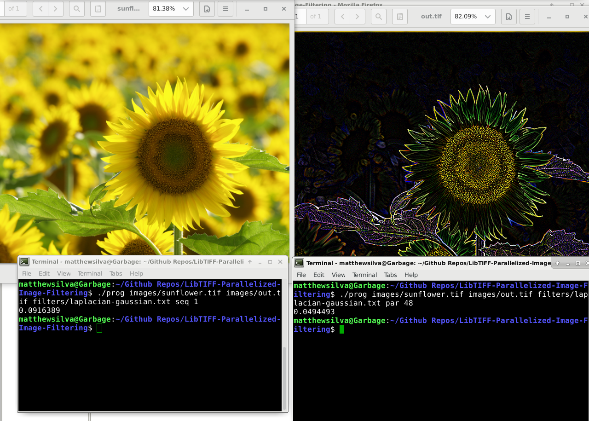
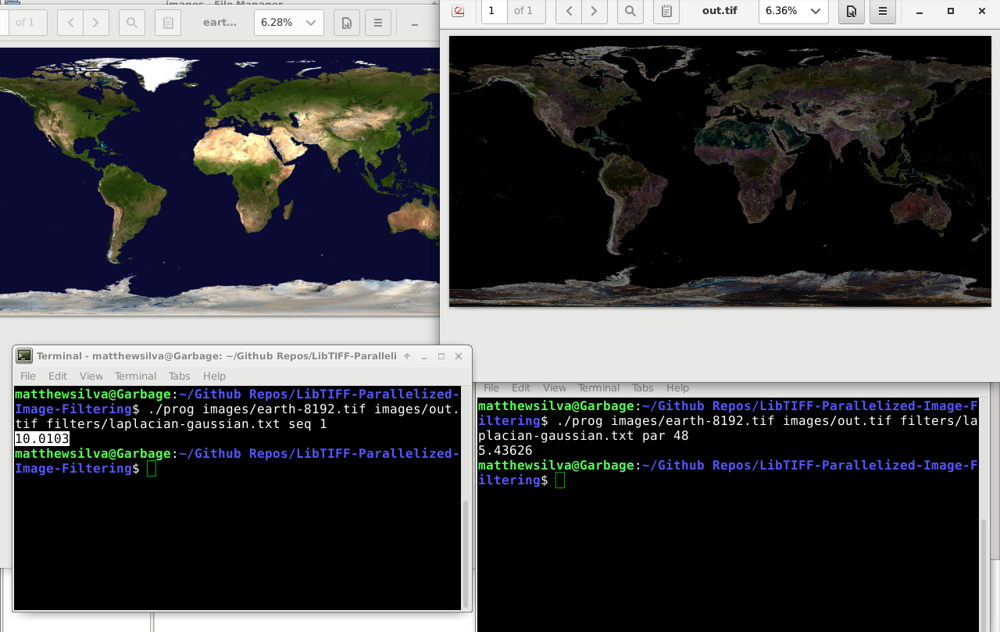
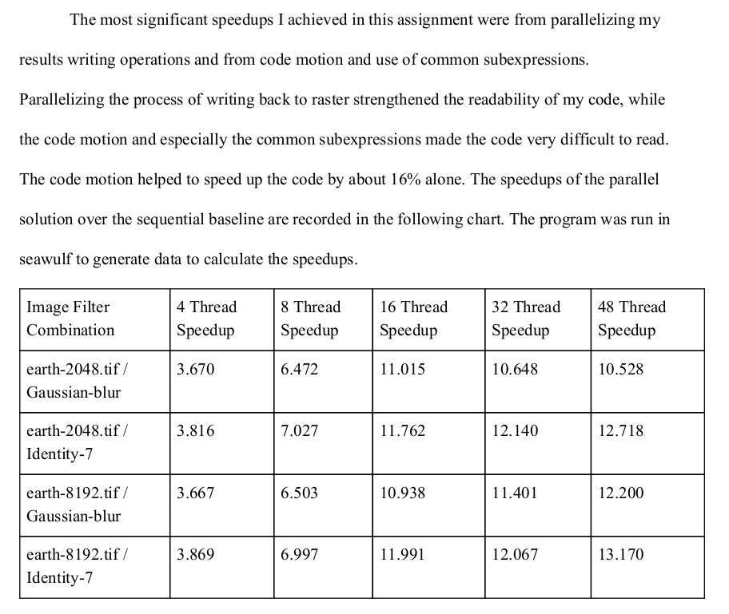

# LibTIFF-Parallelized-Image-Filtering

# Dependencies / Installation

	Your CPU must support Intel AVX Intrinsics
	
	
	Install LibTIFF (On Debian) with
	
	sudo apt install libtiff5-dev
	
	(Find LibTIFF in your distro's package manager to install)
	
# Running the Code

Compile and Run:
	
	To compile and run the code, execute the myjobcopy.sh bash script from the source directory with
	
	sh myjobcopy.sh
	
	Note as well that this bash script is intended to be used with SLURM on a high performance computing cluster,
	so many of the tests will take a very long time to run on a common desktop PC
	
	(This also outputs a bunch of performance info in CSV format, which 
	 is available in a much more readable form in the included PDF report)

Please note that the very poor speedup times are due to running on poor local hardware that did not benefit
very much from vectorization.

The speedup chart in the Deliverables section below shows the speedups when running on an HPC cluster

# Deliverables

See the PDF Report for a full explanation of how the filtering operations were parallelized. Decomposing the
task and assigning it to the appropriate threads was a very interesting project. It was challenging to figure out
which parts of the task were truly unable to be parallelized and which simply needed better synchronization mechanisms
like barriers and mutex locks to function properly in parallel.